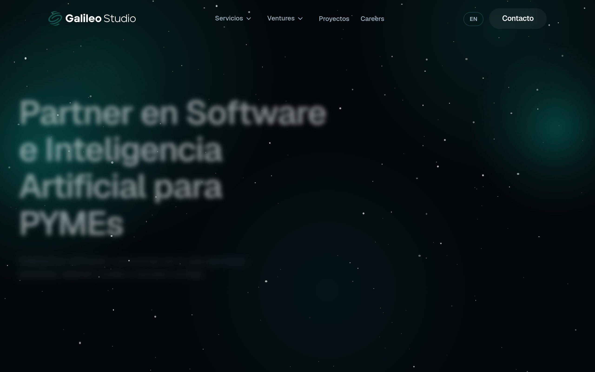

# galileostudio DESIGN.md

> Auto-generated design system — reverse-engineered via static analysis by skillui.
> Frameworks: None detected
> Colors: 20 · Fonts: 2 · Components: 8
> Icon library: not detected · State: not detected
> Primary theme: light · Dark mode toggle: no · Motion: expressive

## Visual Reference

**Match this design exactly** — study colors, fonts, spacing, and component shapes before writing any UI code.



---

## 1. Visual Theme & Atmosphere

This is a **light-themed** interface with a warm, approachable feel. The light background emphasizes content clarity. Typography uses **Geist** throughout — a clean, modern choice that maintains consistency. Spacing follows a **4px base grid** (compact density), with scale: 4, 8, 12, 16, 20, 24, 28, 32px. The accent color **#ff8b1a** anchors interactive elements (buttons, links, focus rings). Motion is expressive — spring physics, layout animations, and staggered reveals are part of the visual language.

---

## 2. Color Palette & Roles

| Token | Hex | Role | Use |
|---|---|---|---|
| tw-ring-offset-color | `#ffffff` | background | Page background, darkest surface |
| card | `#07131b` | surface | Card and panel backgrounds |
| color-gray-100 | `#f3f4f6` | surface | Card and panel backgrounds |
| color-gray-900 | `#101828` | text-primary | Headings and body text |
| color-gray-500 | `#6a7282` | text-muted | Captions, placeholders, secondary info |
| color-orange-400 | `#ff8b1a` | accent | CTAs, links, focus rings, active states |
| color-red-500 | `#fb2c36` | danger | Error states, destructive actions |
| color-amber-400 | `#fcbb00` | warning | Warning states, caution indicators |
| color-blue-500 | `#3080ff` | info | Informational highlights |
| color-blue-400 | `#54a2ff` | unknown | Palette color |
| color-violet-400 | `#a685ff` | unknown | Palette color |
| color-violet-500 | `#8d54ff` | unknown | Palette color |
| color-black | `#000000` | unknown | Palette color |
| ring | `#09c6b8` | unknown | Palette color |
| color-red-400 | `#ff6568` | unknown | Palette color |
| color-cyan-200 | `#a2f4fd` | unknown | Palette color |
| color-cyan-400 | `#00d2ef` | unknown | Palette color |
| color-violet-300 | `#c4b4ff` | unknown | Palette color |
| color-zinc-900 | `#18181b` | unknown | Palette color |
| color-red-700 | `#bf000f` | unknown | Palette color |

### CSS Variable Tokens

```css
--tw-border-style: solid;
--tw-border-style: dashed;
--background: #030609;
--foreground: #f4f7fb;
--card: #07131b;
--card-foreground: #f4f7fb;
--primary: #8aceb3;
--primary-foreground: #021817;
--secondary: #10202b;
--secondary-foreground: #edf4f8;
--muted: #0a161f;
--muted-foreground: #9cb5c4;
--accent: #0b1d25;
--accent-foreground: #f4f7fb;
--border: #15414b;
--tw-border-style: solid;
--tw-border-style: dashed;
--background: #030609;
--foreground: #f4f7fb;
--card: #07131b;
```


---

## 3. Typography Rules

**Font Stack:**
- **Geist** — Heading 1, Heading 2, Heading 3, Body, Caption
- **SFMono-Regular** — Code

**Font Sources:**

```css
@font-face {
  font-family: "Geist";
  src: url("fonts/Geist-Bold.ttf") format("truetype");
  font-weight: 700;
}
@font-face {
  font-family: "Geist";
  src: url("fonts/Geist-Regular.ttf") format("truetype");
  font-weight: 400;
}
```

| Role | Font | Size | Weight |
|---|---|---|---|
| Heading 1 | Geist | 11px | 700 |
| Heading 2 | Geist | 10px | 700 |
| Heading 3 | Geist | 9px | 700 |
| Body | Geist | 8px | 400 |
| Caption | Geist | inherit | 400 |
| Code | SFMono-Regular | 14px | 400 |

**Typographic Rules:**
- Use **Geist** for all text — do not mix font families
- Maintain consistent hierarchy: no more than 3-4 font sizes per screen
- Headings use bold (600-700), body uses regular (400)
- Line height: 1.5 for body text, 1.2 for headings
- Use color and opacity for secondary hierarchy, not additional font sizes


---

## 4. Component Stylings

### Layout (1)

**Footer** — `html`

### Navigation (1)

**Navigation** — `html`

### Data Display (2)

**Card** — `html`
- Variants: `/60`, `/70`, `/40`, `/50`, `/80`

**List** — `html`

### Data Input (1)

**Button** — `html`
- Animation: 

### Media (3)

**Image** — `html`

**Icon** — `html`

**Map/Canvas** — `html`


---

## 5. Layout Principles

- **Base spacing unit:** 4px
- **Spacing scale:** 4, 8, 12, 16, 20, 24, 28, 32, 36, 40, 44, 48
- **Border radius:** .25rem, 1.1rem, 1.25rem, 1.5rem, 2px, 2rem, 2.5rem, 3rem, inherit, 12px
- **Max content width:** 96rem

**Spacing as Meaning:**
| Spacing | Use |
|---|---|
| 4-8px | Tight: related items within a group |
| 12-16px | Medium: between groups |
| 24-32px | Wide: between sections |
| 48px+ | Vast: major section breaks |


---

## 6. Depth & Elevation

### Floating — dropdowns, popovers, modals

- `0 0 12px #09c6b840`
- `0 0 20px #09c6b866`

### Z-Index Scale

`0, 10, 20, 30, 50, 90, 95, 100, 110, 2147483647`


---

## 7. Animation & Motion

This project uses **expressive motion**. Animations are an integral part of the experience.

### CSS Animations

- `@keyframes marquee`
- `@keyframes orbit-spin`
- `@keyframes orbit-counter-spin`
- `@keyframes pulse-glow`
- `@keyframes spin`
- `@keyframes pulse`

### Animated Components

- **Button**: 

### Motion Guidelines

- Duration: 150-300ms for micro-interactions, 300-500ms for page transitions
- Easing: `ease-out` for enters, `ease-in` for exits
- Always respect `prefers-reduced-motion`


---

## 8. Do's and Don'ts

### Do's

- Use `#ff8b1a` for interactive elements (buttons, links, focus rings)
- Use `#ffffff` as the primary page background
- Use **Geist** for all UI text
- Follow the **4px** spacing grid for all margins, padding, and gaps
- Use the defined shadow tokens for elevation — see Section 6
- Use border-radius from the scale: .25rem, 1.1rem, 1.25rem, 1.5rem, 2px
- Reuse existing components from Section 4 before creating new ones

### Don'ts

- Don't introduce colors outside this palette — extend the design tokens first
- Don't mix font families — use Geist consistently
- Don't use arbitrary spacing values — stick to multiples of 4px
- Don't create custom box-shadow values outside the system tokens
- Don't use arbitrary border-radius values — pick from the defined scale
- Don't duplicate component patterns — check Section 4 first


---

## 9. Responsive Behavior

| Name | Value | Source |
|---|---|---|
| sm | 40rem | css |
| md | 48rem | css |
| lg | 64rem | css |
| xl | 80rem | css |
| 2xl | 96rem | css |

**Approach:** Use `@media (min-width: ...)` queries matching the breakpoints above.


---

## 10. Agent Prompt Guide

Use these as starting points when building new UI:

### Build a Card

```
Background: #07131b
Border: 1px solid var(--border)
Radius: 2rem
Padding: 16px
Font: Geist
Use shadow tokens from Section 6.
```

### Build a Button

```
Primary: bg #ff8b1a, text white
Ghost: bg transparent, border var(--border)
Padding: 8px 16px
Radius: 2rem
Hover: opacity 0.9 or lighter shade
Focus: ring with #ff8b1a
```

### Build a Page Layout

```
Background: #ffffff
Max-width: 96rem, centered
Grid: 4px base
Responsive: mobile-first, breakpoints from Section 9
```

### Build a Stats Card

```
Surface: #07131b
Label: #6a7282 (muted, 12px, uppercase)
Value: #101828 (primary, 24-32px, bold)
Status: use success/warning/danger from Section 2
```

### Build a Form

```
Input bg: #ffffff
Input border: 1px solid var(--border)
Focus: border-color #ff8b1a
Label: #6a7282 12px
Spacing: 16px between fields
Radius: 2rem
```

### General Component

```
1. Read DESIGN.md Sections 2-6 for tokens
2. Colors: only from palette
3. Font: Geist, type scale from Section 3
4. Spacing: 4px grid
5. Components: match patterns from Section 4
6. Elevation: shadow tokens
```
